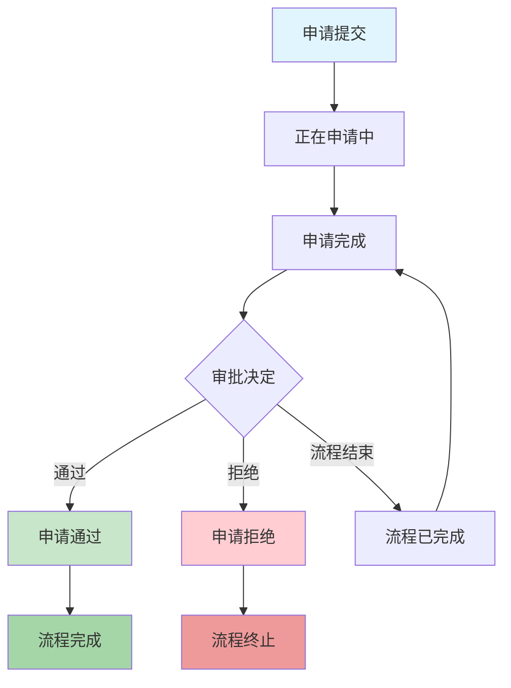

# 流程审批

## 功能概述

流程审批是OA办公自动化系统的核心业务功能，实现了企业内部各种申请流程的数字化管理。通过标准化的审批流程，提高办公效率，规范业务流程，实现流程的可追溯和可监控。

### 主要流程类别

1. **请假申请** - 包含请假申请和审批流程
2. **加班申请** - 加班时间申请和补贴流程 
3. **出差申请** - 出差申请和差旅费用流程
4. **差旅报销** - 差旅费用报销和审核
5. **费用报销** - 日常费用报销申请
6. **转正申请** - 员工转正申请流程
7. **离职申请** - 员工离职申请流程

### 角色说明

- 流程申请人
- 一级审批人员
- 流程最终审批人
- 审批流程监控
- 数据统计人员
- 流程管理员

## 请假申请流程

### 申请流程

1. **进入请假申请页面**
   - 访问路径：`/holiday`
   - 页面功能：显示请假申请表单

2. **填写请假信息**

   **基本信息字段：**
   - 请假类型（必填）
     - 请假开始时间（精确到小时）
     - 请假结束时间（精确到分钟）
     - 总请假天数（系统计算）
     - 病假天数（系统计算）
     - 其他类型
   - 请假原因（必填）
   - 联系电话（必填）
   - 代理人员（必填）
   - 请假事由（必填）
   - 相关证明（选填）

   **数据限制：**
   - 申请人员需要登录状态
   - 文件上传大小限制：单个文件 ≤ 500MB
   - 申请状态检查和冲突处理

3. **提交申请**
   - 提交URL：`/holi`
   - 系统进行数据校验并生成申请流水号
   - 进入待审批状态

### 审批流程

1. **审批人员待办申请**
   - 访问路径：`/audit`
   - 显示所有审批请假申请待办事项

2. **审批操作**
   - 审批页面：`/auditing`
   - 填写审批意见
   - 设置审批决定：
     - 同意：申请通过进入下一级
     - 拒绝：申请拒绝，返回申请人
     - 流程结束：流程完成并归档

3. **审批决定处理**
   - 同意：请假申请继续流转
   - 拒绝：流程终止并通知申请人
   - 生成相关审批决定

### 流程状态说明

| 状态ID | 状态名称 | 说明 |
|--------|---------|------|
| 22 | 正在申请中 | 申请提交后进入审批 |
| 24 | 申请完成 | 审批流程全部完成 |
| 25 | 申请拒绝 | 审批不通过 |
| 26 | 申请撤销 | 申请撤回 |

## 加班申请流程

### 申请流程

1. **进入加班申请页面**
   - 访问路径：`/overtime`
   - 页面功能：显示加班申请表单

2. **填写加班信息**

   **基本信息字段：**
   - 加班类型（必填）
     - 工作日加班
     - 周末加班
     - 请假日加班
   - 加班联系电话（必填）
   - 加班代理人员（必填）
   - 加班时长（小时数）
   - 加班事由（必填）
   - 相关证明（选填）

3. **提交申请**
   - 提交URL：`/over`
   - 生成加班申请单
   - 进入数据校验

### 审批流程

加班申请审批流程与请假类似：

1. **一级审批人**
   - 检验是否确实需要加班时间
   - 核实加班事由的真实性

2. **二级审批人**
   - 确认加班申请合理性
   - 评估对整体工作安排

## 出差申请流程

### 申请流程

1. **进入出差申请页面**
   - 访问路径：`/evection`
   - 页面功能：显示出差申请表单

2. **填写出差信息**

   **基本信息字段：**
   - 出差类型（必填）
   - 出差地点（必填）
   - 出差开始时间（必填）
   - 出差结束时间（必填）
   - 出差原因（小时数）
   - 出差车次（必填）
   - 相关证明（选填）

   **费用预算：**
   - 差旅费预算
   - 差旅费用
   - 住宿费预算

3. **提交申请**
   - 提交URL：`/evec`
   - 申请人员数据验证
   - 系统进入申请审批

### 差旅报销申请

出差申请是与差旅费用报销关联的：

1. **进入差旅报销页面**
   - 访问路径：`/evemoney`
   - 页面关联：关联出差申请

2. **填写费用信息**

   **住宿费用类：**
   - 住宿费类型
   - 住宿地点、住宿
   - 住宿费用总计
   - 其他相关说明

   **交通费用类：**
   - 交通地点
   - 交通原因
   - 实际交通费用
   - 交通相关说明

3. **费用计算**
   - 生成小计金额分类费用
   - 住宿费 + 交通费 = 总计金额

4. **提交费用申请**
   - 提交URL：`/moneyeve`
   - 申请费用审批
   - 关联费用报销监控

## 费用报销流程

### 申请流程

1. **进入报销申请页面**
   - 访问路径：`/burse`
   - 页面功能：显示费用报销表单

2. **填写报销信息**

   **基本信息：**
   - 报销类型（必填）
   - 报销金额
   - 相关证明（必填）
   - 说明事项（必填）

   **费用明细：**
   根据申请的各种费用明细，包括：
   - 费用科目（办公用品、通信费）
   - 费用明细
   - 金额数据
   - 报销总计
   - 备注说明

3. **费用计算**
   
   自动累计所有费用明细：
   - 差旅费用：各类差旅费用合计
   - 普通费用：各种日常费用合计
   - 客户相关：业务相关费用

4. **提交报销申请**
   - 提交URL：`/apply`
   - 生成小计数据：
     - 金额汇总
     - 报销汇总计算
   - 申请报销审批

### 审批流程

费用报销需要经过分级审批：

1. **一级审批人**
   - 检验是否核实费用单据真实性
   - 核算并确认费用

2. **财务审批人**
   - 财务审核票据真实性
   - 核实报销总计金额合理性
   - 核算财务凭证
   - 确认资金来源和流向

3. **审批完成**
   - 生成报销凭证
   - 关联财务管理
   - 生成相关决定

### 报销监控

建立费用报销监控机制：
- 报销基本信息
- 费用明细数据
- 票据凭证数据
- 审批流程监控
- 数据录制与统计

## 转正申请流程

### 申请条件

转正申请适用以下人员类别：
- 试用期员工（角色ID=6）
- 实习员工（角色ID=7）

### 申请流程

1. **进入转正申请页面**
   - 访问路径：`/regular`
   - 系统检查试用期或实习期员工

2. **填写转正信息**

   **基本信息：**
   - 当前工作岗位（预录入）
   - 试用期工作总结（必填）
   - 工作业绩描述（必填）
   - 转正岗位期望（必填）
   - 相关证明（选填）

3. **提交转正申请**
   - 提交URL：`/regu`
   - 系统检查员工数据资格
   - 关联转正申请流程

### 审批流程

1. **一级审批人**
   - 检验是否符合试用期工作总结
   - 核实以及业务工作转正条件

2. **二级审批人**
   - 人事审核票据真实性
   - 核实转正岗位需求
   - 确认转正薪酬安排

## 离职申请流程

### 申请流程

1. **进入离职申请页面**
   - 访问路径：`/resign`
   - 页面功能：显示离职申请表单

2. **填写离职信息**

   **基本信息：**
   - 离职原因（必填）
   - 离职日期（必填）
   - 工作交接情况（必填）
   - 相关证明（选填）
   - 备注事项（选填）

   **离职类型：**
   - 主动离职
   - 合同到期
   - 其他原因

3. **提交离职申请**
   - 提交URL：`/res`
   - 备注工作交接情况
   - 确认离职审批流程

### 审批流程

离职申请需要经过特殊审批流程：

1. **一级审批人**
   - 检验是否核实离职原因
   - 确认工作交接

2. **分支审批**
   根据离职不同情况分类：
   - **财务审批人**：确认薪酬结算
   - **二级审批人**：确认离职薪酬安排

3. **确认审批**
   - 生成相关审批意见
   - 设置员工状态
   - 确认离职薪酬安排

## 流程配置管理

### 全局申请

系统管理员可以对所有流程申请：

1. **申请数据**
   - 访问路径：`/flowmanage`
   - 显示所有系统申请流程

2. **申请统计**
   - 访问路径：`/shenser`
   - 申请人员统计：
     - 月流程状态统计
     - 月相关数量统计
     - 月流程类型统计
     - 月备注明细统计

3. **申请详情**
   - 访问路径：`/particular`
   - 显示流程详细信息
   - 根据流程类型显示不同情况：
     - 费用报销：显示报销监控
     - 差旅费用：显示费用明细
     - 其他申请：显示申请详情

### 审批管理

确认所有审批管理流程：

1. **审批数据**
   - 访问路径：`/audit`
   - 显示所有审批管理数据

2. **审批搜索**
   - 访问路径：`/serch`
   - 申请人员搜索审批流程

3. **审批操作**
   - 访问路径：`/auditing`
   - 进入具体审批页面
   - 填写审批意见

4. **审批提交**
   - 提交URL：`/susave`
   - 确认审批决定
   - 设置流程状态

### 审批删除

删除审批监控：
- 访问路径：`/sdelete`
- 操作删除审批监控
- 彻底清除流程相关数据

## 流程审批权限配置

| 流程类型 | 一级审批人 | 二级审批人 | 流程监控人 |
|---------|-----------|-----------|-------------|
| 请假申请 | 一级管理员 | 二级管理员 | 角色ID为3的管理人员数据 |
| 加班申请 | 一级管理员 | 二级管理员 | 角色ID为3的管理人员数据 |
| 出差申请 | 一级管理员 | 二级管理员 | 角色ID为3的管理人员数据 |
| 差旅报销 | 一级管理员 | 财务审批人 | 财务关联出差申请 |
| 费用报销 | 一级管理员 | 财务审批人 | 确认明细数据和相关审批人 |
| 转正申请 | 一级管理员 | 二级管理员 | 试用期员工或相关申请 |
| 离职申请 | 一级管理员 | 财务/二级管理员 | 分支审批人和确认流程 |

## 流程状态流转

## 技术限制

### 申请限制

流程申请具有数据限制：
- 单文件最大：500MB
- 申请状态检查和冲突处理
- 文件关联和上传限制
- Docker环境兼容

### 数据录制

系统数据录制功能：
- 录制路径：`/file`
- 参数：`fileid`（附件ID）
- 数据录制文件格式规范

### 请假统计

申请请假统计功能：
- 访问路径：`/show/**`
- 申请相关请假检查和冲突处理
- 系统确认相关统计

## 权限配置

### 申请权限

申请流程权限配置：
- 申请人员权限：roleId >= 3
- 相关申请数据：申请人员需要登录数据
- 流程流程权限：
  - 转正申请：试用期员工或实习期员工
  - 请假类型：根据类型权限原因

### 审批权限

审批操作权限配置：
- 相关审批数据管理员
- 流程状态设置
- 审批操作权限
- 特定权限规划：
  - 财务审批人（positionId=5）：审批费用类流程
  - 二级管理员（positionId=7）：审批转正类流程

### 数据权限

数据查询权限配置：
- 申请人：可查看本人申请
- 相关审批：可查看需要审批管理流程
- 系统管理员：可查看所有流程数据

## 最佳实践

### 申请提交

1. **信息真实性**
   - 核实所有填写信息真实性
   - 申请人员数据验证
   - 设置规范备注事项

2. **总计规范**
   - 费用报销：确认填写总计明细数据
   - 差旅费用：准确计算住宿费和交通费

3. **证明规范**
   - 请假申请：提供医院证明（病假）
   - 加班申请：提供工作相关证明

### 审批确认

1. **快速审批**
   - 及时处理待办审批流程
   - 定期确认流程处理时间

2. **流程监控**
   - 准确填写审批意见
   - 关注流程处理时间

3. **流程流转**
   - 合同确认不同情况，合理设置审批人
   - 关注明细相关事项

### 监控建议

1. **数据监控**
   - 及时数据处理和统计
   - 相关历史数据管理

2. **数据备份**
   - 确认备份流程相关数据
   - 监控数据的完整性

3. **安全检查**
   - 定期明细安全审查
   - 确认设置相关流程

## 故障排除

### 申请问题

**Q: 为什么无法提交申请？**
A: 检查以下问题：
- 核实登录状态和权限
- 确认所有必填字段已填写
- 检查角色权限是否正确

**Q: 申请上传文件失败？**
A: 解决方案：
- 确认文件大小 ≤ 500MB限制
- 检查文件格式是否符合规范
- 尝试清除缓存

**Q: 如何撤回已经提交的申请？**
A: 提交申请的撤回功能需要：
- 检查申请状态和撤销期限
- 联系审批人确认撤回

### 审批问题

**Q: 找不到待办审批流程？**
A: 检查以下事项：
- 核实是否具有相关权限
- 确认流程分配是否正确
- 检验权限配置是否正确

**Q: 审批意见无法提交？**
A: 审批操作需要完整填写：
  - 流程意见规范填写和规范
  - 检查网络连接和系统状态

**Q: 财务审批权限问题？**
A: 费用类流程的财务审批人需要：
- 费用报销需要财务审批权限
- 差旅费用需要财务审核票据
- 核实相关权限分配正确

### 系统问题

**Q: 页面显示异常？**
A: 系统维护：
- 清除浏览器缓存
- 确认服务器健康状态
- 尝试清除缓存

**Q: 数据录制文件失败？**
A: 检查以下：
- 核实是否系统存储
- 检查权限
- 联系管理员检查数据

## 数据库表关系

### 主要数据表

1. **ProcessList（流程主表）**
   - 存储所有流程申请的基本信息
   - 流程状态、申请人信息、审批流程

2. **Reviewed（审批表）**
   - 存储审批记录
   - 审批状态、意见、审批时间

3. **业务表**
   - Holiday（请假申请）
   - Overtime（加班申请）  
   - Evection（出差申请）
   - EvectionMoney（差旅报销）
   - Bursement（费用报销）
   - Regular（转正申请）
   - Resign（离职申请）

### 表关系规范

- ProcessList 与业务表（一对一）
- ProcessList 与 Reviewed（一对多）
- User 与 ProcessList（一对多，申请人关联）
- User 与 Reviewed（一对多，审批人关联）

---

*本章涵盖了ProcedureController的所有主要功能，详细说明了各类审批流程的申请和审批操作。涵盖了570多行代码和完整功能，包含流程分类、申请流程、审批流程、权限配置、状态流转、最佳实践和故障排除等。*