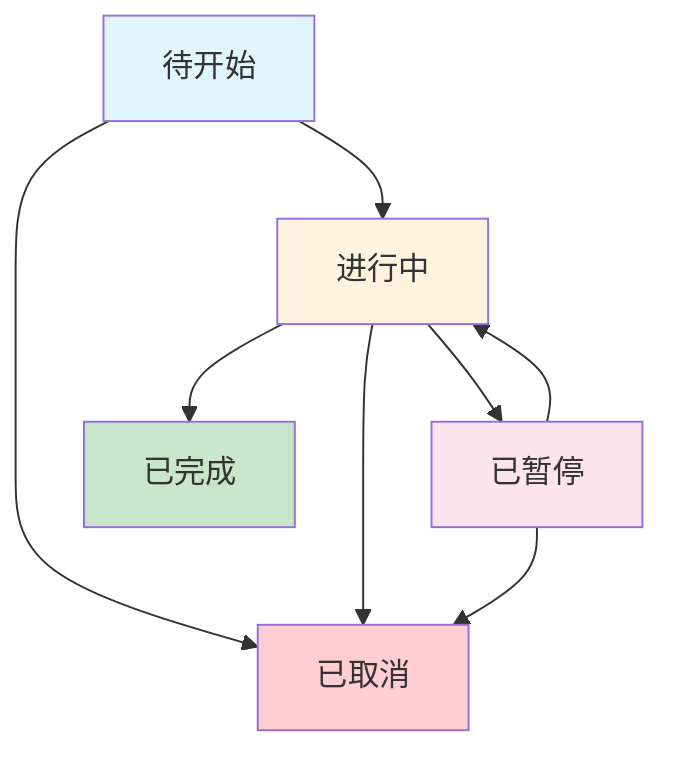

# 任务管理

## 模块概述

任务管理是OA系统中重要的项目协作功能，支持任务的创建、分配、跟踪和管理。系统提供完整的任务生命周期管理，包括任务分配、状态跟踪、进度反馈和完成确认。

### 核心功能

- **任务创建和分配** - 创建任务并分配给指定人员
- **任务状态管理** - 跟踪任务进度和状态变更
- **任务日志系统** - 记录任务执行过程和反馈
- **我的任务管理** - 个人任务视图和操作
- **权限控制** - 基于角色的任务管理权限

### 用户角色

1. **任务发布者** - 创建、分配和管理任务
2. **任务接收者** - 执行任务并反馈进度
3. **管理员** - 系统级任务管理权限

## 任务管理主页

### 访问任务管理

- **访问路径：** `/taskmanage`
- **功能描述：** 显示当前用户作为发布者的所有任务列表

### 主要功能区域

1. **任务列表显示**
   - 任务标题和描述
   - 任务状态和优先级
   - 发布时间和修改时间
   - 接收人信息

2. **操作按钮**
   - 新增任务
   - 查看详情
   - 编辑任务
   - 删除任务

3. **搜索和排序**
   - 按任务标题搜索
   - 按状态筛选
   - 按时间排序

## 创建新任务

### 进入创建页面

- **访问路径：** `/addtask`
- **权限要求：** 具有任务发布权限的用户

### 任务创建表单

#### 基本信息字段

1. **任务标题**（必填）
   - 简洁明确的任务名称
   - 字符长度限制：50字符以内

2. **任务描述**（必填）
   - 详细说明任务内容和要求
   - 支持富文本编辑
   - 包含任务目标、交付物等

3. **任务类型**（必填）
   - 从系统预设类型中选择
   - 如：开发任务、测试任务、文档任务等

4. **优先级设置**（必填）
   - 高优先级：紧急重要任务
   - 中优先级：正常任务
   - 低优先级：非紧急任务

5. **任务状态**（必填）
   - 初始状态：待开始
   - 可设置为：进行中、已完成等

#### 任务分配

1. **接收人选择**（必填）
   - 支持多人分配
   - 从部门员工列表中选择
   - 显示员工姓名、职位、部门信息

2. **部门筛选**
   - 按部门筛选员工
   - 快速定位目标人员

3. **职位筛选**
   - 按职位筛选员工
   - 确保合适的人员分配

### 提交任务

- **提交URL：** `/addtasks`
- **处理逻辑：**
  1. 验证表单数据完整性
  2. 设置任务发布人信息
  3. 保存任务主表数据
  4. 创建任务接收人关联记录
  5. 初始化任务状态

## 任务编辑

### 进入编辑页面

- **访问路径：** `/edittasks`
- **参数：** `id`（任务ID）
- **权限验证：** 仅任务发布者可编辑

### 编辑功能

1. **基本信息修改**
   - 任务标题和描述
   - 任务类型和优先级
   - 预计时间调整

2. **接收人管理**
   - 添加新的接收人
   - 移除现有接收人
   - 批量操作支持

3. **状态更新**
   - 手动调整任务状态
   - 状态变更记录

### 保存更新

- **提交URL：** `/update`
- **更新逻辑：**
  1. 更新任务主表信息
  2. 重新分析接收人列表
  3. 更新任务用户关联表
  4. 记录修改时间和操作人

## 任务详情查看

### 任务发布者视图

- **访问路径：** `/seetasks`
- **显示内容：**
  1. 任务完整信息
  2. 当前状态和进度
  3. 所有接收人列表
  4. 任务日志历史
  5. 状态变更记录

### 功能操作

1. **状态管理**
   - 查看所有状态选项
   - 了解状态含义

2. **日志查看**
   - 按时间顺序显示
   - 包含操作人和操作内容
   - 状态变更原因

3. **反馈记录**
   - 接收人的进度反馈
   - 问题和解决方案

## 任务状态系统

### 状态定义

| 状态ID | 状态名称 | 说明 | 操作权限 |
|--------|---------|------|---------|
| 1 | 待开始 | 任务已分配但尚未开始 | 接收人可开始 |
| 2 | 进行中 | 任务正在执行中 | 接收人可更新进度 |
| 3 | 已暂停 | 任务临时暂停 | 接收人和发布者 |
| 4 | 已完成 | 任务执行完毕 | 接收人可标记完成 |
| 5 | 已取消 | 任务被取消 | 仅发布者可操作 |

### 状态流转规则

### 状态同步机制

任务的总体状态基于所有接收人的状态决定：
- **选择最小状态ID** - 确保任务进度反映最慢的执行者
- **自动更新机制** - 接收人状态变更时自动更新任务总状态
- **状态一致性** - 保证任务状态与实际进度匹配

## 我的任务

### 任务接收者视图

- **访问路径：** `/mytask`
- **功能描述：** 显示分配给当前用户的所有任务

### 任务列表

1. **显示信息**
   - 任务标题和优先级
   - 任务发布者信息
   - 当前状态和进度
   - 分配时间和截止时间

2. **状态筛选**
   - 待处理任务
   - 进行中任务
   - 已完成任务
   - 全部任务

### 任务搜索

- **搜索路径：** `/mychaxun`
- **搜索条件：**
  - 任务标题关键字搜索
  - 支持模糊匹配
  - 实时搜索结果

## 任务详情和反馈

### 接收者任务详情

- **访问路径：** `/myseetasks`
- **显示内容：**
  1. 任务详细信息
  2. 发布者要求和说明
  3. 当前个人状态
  4. 历史日志记录
  5. 反馈操作区域

### 任务反馈功能

#### 状态更新

1. **状态选择**
   - 从可用状态中选择
   - 状态说明和要求
   - 确认状态变更

2. **反馈内容**
   - 进度说明（必填）
   - 遇到的问题
   - 需要的支持
   - 预计完成时间

#### 日志记录

- **提交URL：** `/uplogger`
- **记录内容：**
  1. 操作时间和操作人
  2. 状态变更信息
  3. 详细反馈内容
  4. 系统自动记录

### 反馈处理逻辑

1. **个人状态更新**
   - 更新任务用户关联表中的个人状态
   - 记录状态变更时间

2. **任务总状态计算**
   - 获取所有接收人的状态
   - 选择最小状态ID作为任务总状态
   - 自动更新任务主表状态

3. **日志保存**
   - 创建任务日志记录
   - 关联用户和任务信息
   - 生成时间戳

## 任务删除管理

### 发布者删除

- **删除路径：** `/shanchu`
- **权限验证：** 仅任务发布者可删除自己发布的任务
- **删除范围：**
  1. 删除任务日志记录
  2. 删除任务接收人关联记录
  3. 删除任务主记录

### 接收者移除

- **移除路径：** `/myshanchu`
- **功能说明：** 接收人可以从自己的任务列表中移除任务
- **处理逻辑：**
  - 仅删除个人与任务的关联记录
  - 不影响其他接收人
  - 不删除任务主体数据

## 任务日志系统

### 日志记录

任务日志系统记录任务执行过程中的所有关键信息：

#### 日志内容

1. **基本信息**
   - 日志创建时间
   - 操作用户名称
   - 关联任务ID

2. **状态信息**
   - 状态变更前后对比
   - 状态变更原因
   - 操作类型标识

3. **反馈内容**
   - 详细进度说明
   - 问题描述和解决方案
   - 下一步计划

#### 日志查看

1. **发布者视图**
   - 查看所有接收人的日志
   - 了解整体任务进度
   - 发现问题和瓶颈

2. **接收者视图**
   - 查看个人历史记录
   - 回顾任务执行过程
   - 参考历史经验

## 任务排序和查询

### 排序功能

- **排序路径：** `/paixu`
- **支持的排序方式：**
  1. 按发布时间排序
  2. 按修改时间排序
  3. 按任务状态排序
  4. 按优先级排序

### 查询条件

1. **关键字搜索**
   - 任务标题模糊匹配
   - 任务描述内容搜索
   - 发布者姓名搜索

2. **状态筛选**
   - 单一状态筛选
   - 多状态组合筛选
   - 自定义状态范围

3. **时间范围**
   - 发布时间范围筛选
   - 预计完成时间筛选
   - 实际完成时间筛选

## 权限控制体系

### 任务创建权限

1. **发布者权限**
   - 具有下级员工的管理权限
   - 可以分配任务给直接下属
   - 查看下属任务执行情况

2. **部门限制**
   - 只能看到本部门及下级部门员工
   - 跨部门任务需要特殊权限
   - 基于组织架构的访问控制

### 任务操作权限

1. **查看权限**
   - 发布者：查看自己发布的所有任务
   - 接收者：查看分配给自己的任务
   - 管理员：查看所有任务

2. **编辑权限**
   - 发布者：编辑自己发布的任务
   - 接收者：更新自己的任务状态和反馈
   - 管理员：具有所有编辑权限

3. **删除权限**
   - 发布者：删除自己发布的任务
   - 接收者：从个人列表中移除任务
   - 系统级删除需要管理员权限

## 员工选择功能

### 员工列表

任务分配时的员工选择功能：

1. **员工显示**
   - 按部门分组显示
   - 显示员工基本信息（姓名、职位、部门）
   - 支持分页浏览

2. **筛选条件**
   - 部门筛选：快速定位特定部门员工
   - 职位筛选：按职位级别筛选
   - 在线状态：显示员工当前状态

3. **权限控制**
   - 只显示有权限分配任务的员工
   - 基于组织架构的可见性控制
   - 跨部门权限验证

### 多选支持

1. **批量选择**
   - 支持多个员工同时分配
   - 批量操作确认
   - 选择状态保持

2. **分配验证**
   - 员工工作负载检查
   - 技能匹配度评估
   - 时间冲突检测

## 最佳实践

### 任务创建

1. **明确任务目标**
   - 使用SMART原则定义任务
   - 明确交付物和验收标准
   - 设定合理的时间预期

2. **合理分配资源**
   - 根据能力分配任务
   - 避免资源过载
   - 考虑技能匹配度

3. **有效沟通**
   - 清晰的任务描述
   - 及时的需求澄清
   - 定期的进度沟通

### 任务执行

1. **及时反馈**
   - 定期更新任务状态
   - 主动报告遇到的问题
   - 提供建设性建议

2. **问题处理**
   - 快速识别问题
   - 寻求必要支持
   - 记录解决方案

3. **质量保证**
   - 严格按照要求执行
   - 做好自我检查
   - 确保交付质量

### 团队协作

1. **信息共享**
   - 透明的进度信息
   - 共享经验和资源
   - 建立知识库

2. **相互支持**
   - 主动提供帮助
   - 分享解决方案
   - 协同解决问题

3. **持续改进**
   - 总结经验教训
   - 优化工作流程
   - 提升团队效率

## 常见问题

### 任务创建问题

**Q: 为什么无法分配任务给某个员工？**
A: 检查以下几点：
- 确认该员工是否为您的直接下属
- 验证员工账户是否激活
- 检查部门权限设置是否正确

**Q: 任务创建后无法编辑怎么办？**
A: 可能原因：
- 任务已被接收人开始执行
- 权限发生变化
- 任务状态不允许编辑

### 状态管理问题

**Q: 任务状态更新不及时？**
A: 排查步骤：
- 检查网络连接是否正常
- 确认是否有权限更新状态
- 查看系统是否有延迟

**Q: 状态回滚如何操作？**
A: 状态回滚方法：
- 联系任务发布者协助处理
- 通过日志记录说明回滚原因
- 管理员可以强制状态调整

### 性能优化问题

**Q: 任务列表加载缓慢？**
A: 优化建议：
- 使用筛选条件减少数据量
- 分页浏览任务列表
- 定期清理完成任务

**Q: 搜索功能响应慢？**
A: 解决方案：
- 使用精确的搜索关键字
- 结合筛选条件缩小范围
- 避免过于宽泛的搜索

## 技术实现说明

### 数据模型

1. **任务主表（Tasklist）**
   - 存储任务基本信息
   - 任务标题、描述、类型等
   - 发布者和时间信息

2. **任务用户关联表（Taskuser）**
   - 多对多关系实现
   - 存储接收人和状态信息
   - 支持个性化状态管理

3. **任务日志表（Tasklogger）**
   - 记录所有操作历史
   - 状态变更和反馈内容
   - 时间戳和用户信息

### 业务逻辑

1. **状态同步机制**
   - 基于最小状态ID算法
   - 自动更新任务总状态
   - 保证数据一致性

2. **权限验证**
   - 基于用户角色和部门关系
   - 动态权限检查
   - 安全访问控制

3. **分页和排序**
   - 高效的数据分页
   - 多字段排序支持
   - 优化查询性能

---

*本文档基于TaskController源码分析生成，涵盖了任务管理模块的完整功能。包含任务创建、分配、跟踪、状态管理、权限控制等核心功能的详细操作指南，为用户提供全面的任务管理解决方案。*