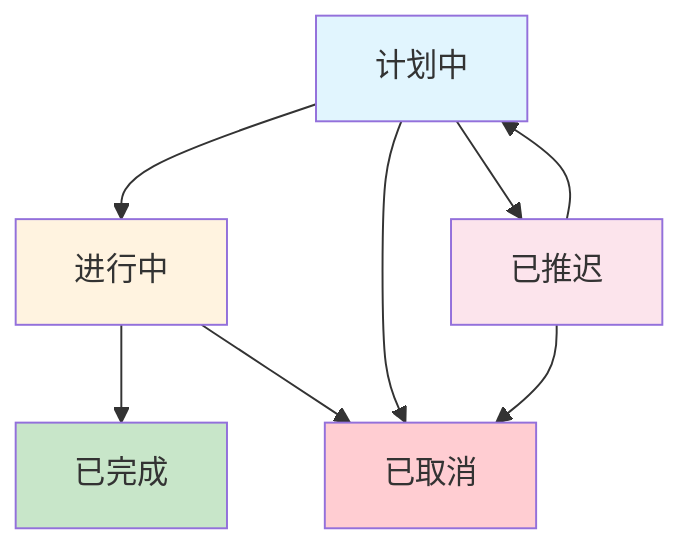

# 日程管理

## 模块概述

日程管理是OA系统中的重要时间管理功能，帮助用户规划、安排和跟踪个人及团队的日程活动。系统提供直观的日历视图、灵活的日程创建、智能的提醒功能和便捷的共享机制。

### 核心功能

- **日程创建和编辑** - 创建个人或团队日程安排
- **日历视图管理** - 多种日历视图展示日程
- **日程共享协作** - 与团队成员共享日程信息
- **智能提醒通知** - 自动提醒重要日程事项
- **日程分类管理** - 按类型和状态组织日程

### 用户角色

1. **日程创建者** - 创建和管理个人日程
2. **日程参与者** - 参与共享日程活动
3. **团队管理者** - 管理团队日程安排

## 日程管理主页

### 访问日程管理

- **访问路径：** `/daymanage`
- **功能描述：** 显示当前用户的个人日程列表

### 主页功能区域

1. **日程列表显示**
   - 日程标题和详细内容
   - 日程类型和状态标识
   - 创建时间和预定时间
   - 参与人员信息

2. **操作功能**
   - 新增日程安排
   - 编辑现有日程
   - 删除日程记录
   - 查看日程详情

3. **筛选和排序**
   - 按日程类型筛选
   - 按状态筛选
   - 按时间排序（默认按状态和创建时间降序）

### 分页浏览

- **分页路径：** `/daymanagepaging`
- **排序方式：** 按用户升序排列
- **分页支持：** 默认每页10条记录

## 日程创建和编辑

### 进入编辑页面

- **访问路径：** `/dayedit`
- **参数说明：**
  - `rcid`：日程记录ID（可选，用于编辑现有日程）
  - `page`：分页参数
  - `size`：每页记录数

### 日程编辑表单

#### 基本信息字段

1. **日程标题**（必填）
   - 简洁清晰的日程名称
   - 字符长度合理控制

2. **日程内容**（必填）
   - 详细的日程描述
   - 活动具体安排
   - 注意事项和要求

3. **日程类型**（必填）
   - 从系统预设类型中选择
   - 类型包括：会议、培训、出差、个人事务等
   - 便于日程分类和统计

4. **日程状态**（必填）
   - 状态选项：计划中、进行中、已完成、已取消
   - 状态管理和进度跟踪

#### 时间设置

1. **开始时间**（必填）
   - 日程开始的具体日期和时间
   - 日期时间选择器支持

2. **结束时间**（必填）
   - 日程结束的具体日期和时间
   - 自动计算日程时长

3. **全天事件**
   - 支持全天事件设置
   - 适用于节假日、纪念日等

#### 人员管理

1. **参与人员**
   - 选择日程参与人员
   - 支持多人参与
   - 从员工列表中选择

2. **共享设置**
   - 设置日程共享范围
   - 控制可见性权限
   - 团队协作支持

### 日程保存

- **提交URL：** `/addandchangeday`
- **处理逻辑：**
  1. 验证日程信息完整性
  2. 设置日程创建者信息
  3. 处理参与人员列表
  4. 保存日程主记录
  5. 建立人员关联关系

## 关于我的日程

### 个人日程视图

- **访问路径：** `/aboutmeday`
- **功能描述：** 显示与当前用户相关的所有日程（包括自己创建的和参与的）

### 显示内容

1. **个人创建的日程**
   - 用户主动创建的日程安排
   - 完整的编辑和管理权限

2. **参与的共享日程**
   - 其他用户邀请参与的日程
   - 查看权限和有限的编辑权限

3. **日程状态统计**
   - 各类型日程数量统计
   - 状态分布情况
   - 时间段分析

### 分页和排序

- **分页路径：** `/aboutmedaypaging`
- **排序规则：** 按用户升序排列
- **分页控制：** 支持灵活的分页浏览

## 日历视图

### 访问日历

- **访问路径：** `/daycalendar`
- **功能描述：** 提供直观的日历界面展示日程安排

### 日历功能特性

1. **多视图支持**
   - 月视图：完整月份日程概览
   - 周视图：详细周程安排
   - 日视图：单日详细时间安排

2. **交互操作**
   - 点击日期快速创建日程
   - 拖拽调整日程时间
   - 快速查看日程详情

3. **视觉标识**
   - 不同类型日程用不同颜色标识
   - 状态图标显示
   - 优先级视觉区分

### 日历数据加载

- **数据接口：** `/mycalendarload`
- **返回格式：** JSON格式的日程列表
- **加载方式：** 异步加载，提升页面响应速度

#### 数据结构

返回的日程数据包含：
- 日程ID和基本信息
- 开始和结束时间
- 日程类型和状态
- 参与人员信息
- 创建者信息

## 日程删除

### 删除操作

- **删除路径：** `/dayremove`
- **参数：** `rcid`（日程记录ID）
- **权限控制：** 仅日程创建者可删除

### 删除处理

1. **权限验证**
   - 验证当前用户是否为日程创建者
   - 检查日程状态是否允许删除

2. **数据清理**
   - 删除日程主记录
   - 清理相关联的人员关系
   - 更新关联统计数据

3. **通知机制**
   - 通知相关参与人员
   - 发送删除确认消息
   - 更新个人日历视图

## 日程类型管理

### 系统预设类型

日程管理系统支持多种预设类型，便于分类管理：

| 类型ID | 类型名称 | 适用场景 | 颜色标识 |
|--------|---------|---------|---------|
| 1 | 会议安排 | 团队会议、客户会议等 | 蓝色 |
| 2 | 培训学习 | 内部培训、外部学习 | 绿色 |
| 3 | 出差计划 | 商务出差、实地考察 | 橙色 |
| 4 | 个人事务 | 个人安排、私人事务 | 灰色 |
| 5 | 项目节点 | 项目里程碑、重要节点 | 红色 |
| 6 | 其他安排 | 其他类型日程 | 紫色 |

### 类型特性

1. **会议安排**
   - 支持会议室预定
   - 参会人员邀请
   - 会议资料共享

2. **培训学习**
   - 培训内容记录
   - 学习进度跟踪
   - 证书管理

3. **出差计划**
   - 行程安排详情
   - 交通住宿信息
   - 费用预算管理

## 日程状态管理

### 状态定义

| 状态ID | 状态名称 | 说明 | 操作权限 |
|--------|---------|------|---------|
| 1 | 计划中 | 日程已安排但尚未开始 | 创建者可修改 |
| 2 | 进行中 | 日程正在进行 | 创建者和参与者 |
| 3 | 已完成 | 日程已结束 | 查看权限 |
| 4 | 已取消 | 日程被取消 | 创建者可操作 |
| 5 | 已推迟 | 日程推迟执行 | 创建者可调整 |

### 状态流转

### 自动状态更新

1. **时间触发**
   - 开始时间到达时自动变为"进行中"
   - 结束时间过后提示更新为"已完成"

2. **手动更新**
   - 创建者可手动调整状态
   - 参与者可反馈状态信息

3. **批量操作**
   - 支持批量状态更新
   - 历史日程批量处理

## 日程共享和协作

### 共享机制

1. **人员选择**
   - 从员工列表选择参与人员
   - 支持部门批量选择
   - 权限级别设定

2. **权限控制**
   - 查看权限：只能查看日程信息
   - 参与权限：可以反馈和更新状态
   - 编辑权限：可以修改部分日程信息

3. **通知机制**
   - 日程创建时通知参与者
   - 日程变更时发送更新通知
   - 状态变化时同步信息

### 协作功能

1. **实时同步**
   - 日程信息实时更新
   - 多人协作无冲突
   - 数据一致性保证

2. **冲突检测**
   - 时间冲突自动检测
   - 资源冲突预警
   - 智能建议替代方案

3. **团队视图**
   - 团队日程统一展示
   - 资源使用情况统计
   - 工作负载分析

## 智能提醒功能

### 提醒设置

1. **提醒时间**
   - 提前15分钟、30分钟、1小时等
   - 自定义提醒时间
   - 多次提醒设置

2. **提醒方式**
   - 系统内消息提醒
   - 邮件通知
   - 短信提醒（如果配置）

3. **提醒内容**
   - 日程标题和时间
   - 参与人员信息
   - 准备事项提醒

### 提醒管理

1. **提醒历史**
   - 查看提醒发送记录
   - 确认提醒接收状态
   - 分析提醒效果

2. **提醒设置**
   - 个性化提醒偏好
   - 免打扰时间设定
   - 优先级提醒规则

## 数据统计和分析

### 个人统计

1. **日程数量统计**
   - 按类型统计日程数量
   - 按状态分析完成情况
   - 按时间段统计活动频率

2. **时间分析**
   - 时间使用效率分析
   - 工作时间分布
   - 效率提升建议

3. **参与度分析**
   - 团队协作参与度
   - 会议出席率统计
   - 协作效果评估

### 团队统计

1. **团队日程概况**
   - 团队整体日程安排
   - 资源使用统计
   - 协作频率分析

2. **效率评估**
   - 团队工作效率指标
   - 日程完成率统计
   - 时间管理效果

## 最佳实践

### 日程创建

1. **信息完整性**
   - 详细的日程描述
   - 准确的时间安排
   - 明确的参与人员

2. **分类管理**
   - 合理选择日程类型
   - 统一的命名规范
   - 清晰的优先级设定

3. **时间规划**
   - 合理安排时间间隔
   - 避免时间冲突
   - 预留缓冲时间

### 团队协作

1. **及时沟通**
   - 提前发布日程安排
   - 及时通知变更信息
   - 主动确认参与状态

2. **资源协调**
   - 合理分配时间资源
   - 避免资源冲突
   - 优化资源使用效率

3. **跟踪反馈**
   - 定期检查日程状态
   - 收集参与者反馈
   - 持续优化安排

### 系统使用

1. **定期维护**
   - 清理过期日程
   - 更新个人偏好设置
   - 优化提醒配置

2. **数据备份**
   - 定期导出重要日程
   - 备份个人设置
   - 保存历史记录

3. **功能利用**
   - 充分使用日历视图
   - 合理设置提醒功能
   - 积极参与团队协作

## 常见问题

### 日程创建问题

**Q: 为什么无法选择某些员工作为参与者？**
A: 检查以下几点：
- 确认员工账户状态是否正常
- 验证是否有权限邀请该员工
- 检查员工是否在同一组织范围内

**Q: 日程时间冲突如何处理？**
A: 解决方案：
- 系统会提示时间冲突
- 可以调整时间避免冲突
- 或者取消冲突的其他日程

### 日历显示问题

**Q: 日历加载缓慢或无法显示？**
A: 排查步骤：
- 检查网络连接状态
- 刷新页面重新加载
- 清理浏览器缓存

**Q: 日程在日历中显示不正确？**
A: 可能原因：
- 时区设置不正确
- 日程时间格式问题
- 浏览器兼容性问题

### 提醒功能问题

**Q: 没有收到日程提醒怎么办？**
A: 检查项目：
- 确认提醒设置是否开启
- 检查邮件或消息设置
- 验证提醒时间设置

**Q: 如何关闭某类日程的提醒？**
A: 设置方法：
- 进入个人设置页面
- 找到提醒偏好设置
- 按类型关闭提醒功能

## 技术实现说明

### 数据模型

1. **日程主表（ScheduleList）**
   - 存储日程基本信息
   - 标题、内容、类型、状态
   - 时间信息和创建者

2. **用户关联表**
   - 存储日程参与者关系
   - 权限级别和参与状态
   - 个人偏好设置

3. **类型状态表**
   - 系统预设类型定义
   - 状态列表管理
   - 配置信息存储

### 业务逻辑

1. **分页排序**
   - 支持多字段排序
   - 高效的分页查询
   - 动态排序条件

2. **权限控制**
   - 基于用户和日程关系的权限验证
   - 动态权限检查
   - 安全访问控制

3. **数据同步**
   - 实时数据更新
   - 多用户协作同步
   - 数据一致性保证

### JSON接口

1. **日历数据接口**
   - RESTful风格设计
   - JSON格式数据交换
   - 异步数据加载

2. **状态更新接口**
   - 实时状态同步
   - 批量操作支持
   - 错误处理机制

---

*本文档基于DaymanageController源码分析生成，涵盖了日程管理模块的完整功能。包含日程创建、日历视图、共享协作、智能提醒等核心功能的详细操作指南，为用户提供全面的时间管理解决方案。*